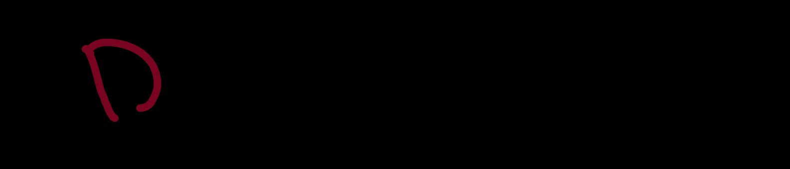
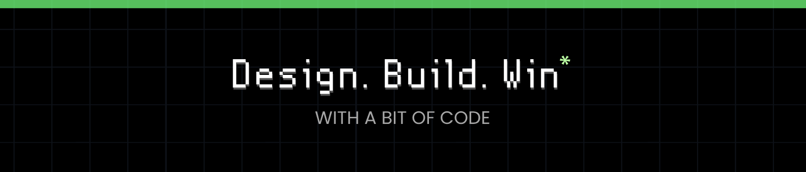

# Hello World!, I'm Jafar, a Designer & Programmer 👋🏼:
🛜 currently working on my own [webpage](https://jafrrhere.netlify.app/) 
👨🏼‍🎓 studying Btech in cse from MIT ADTU 
👨🏼‍💻 I love making designs and programs  

# 💻 Tech Stack:
          ;

